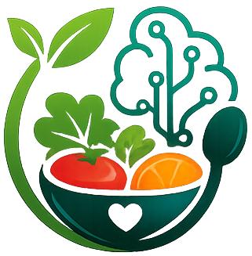

<picture>
  <source media="(prefers-color-scheme: dark)" srcset="./public/NutriAI-logo.png">
  
</picture>

<p align="center">
  <strong>AI-Powered Meal Planning & Nutrition Tracking</strong><br>
  Personalized 7-day meal plans · AI nutrition analysis · Smart food classification
</p>

<p align="center">
  <a href="https://nutri-ai-sepia.vercel.app" target="_blank"><strong>🌐 Live Demo</strong></a> ·
  <a href="#features"><strong>Features</strong></a> ·
  <a href="#tech-stack"><strong>Tech Stack</strong></a> ·
  <a href="#getting-started"><strong>Setup</strong></a> ·
  <a href="#project-structure"><strong>Structure</strong></a>
</p>

<p align="center">
  
  
  
  
  
  
</p>

---

## Overview

NutriAI is a full-stack web application that leverages three specialized AI agents to simplify meal planning and nutrition tracking. Log your meals, get AI-generated 7-day meal plans tailored to your goals, and receive automated nutrition analysis — all powered by Groq's LLM runtime through a clean LangChain agent architecture.

The backend ([nutri-ai-server](https://github.com/ZunaidChowdhury/nutri-ai-server)) runs as a separate Express API with the full agent pipeline, while this Next.js frontend provides a polished, responsive interface with light/dark theme support.

---

## Features

### 🤖 Three Specialized AI Agents

| Agent | Purpose |
|---|---|
| **Meal Planning Agent** | Generates personalized 7-day plans from your goals, restrictions, and calorie targets — uses dietary preferences, meal database lookups, and nutritional balance checks |
| **Nutrition Analysis Agent** | Analyzes your last 7 days of logged meals, identifies nutrient deficiencies, and provides actionable recommendations with optional prior-report awareness |
| **Food Classification Agent** | Suggests cuisine tags with confidence scores when adding new meals — one-shot LLM call for instant inline suggestions |

All agents follow an identical pipeline: **Agent Router → Agent → Prompt → Tools → ChatGroq → Structured Output → Zod Validation → Response**, with a single shared `ChatGroq` service and exactly four internal tools (no external API calls).

### 🍽️ Meal Management
- **Explore** – Browse, search, filter by cuisine/calories, sort, and paginate meals
- **Detail pages** – Full macros, ratings, and related meal suggestions
- **Add meals** – Upload images via Uploadthing, with AI-powered cuisine tag suggestions
- **Manage meals** – View and delete your own meals (admin can delete any)

### 📊 Dashboard & Analytics
- **Calories-over-time** line chart (7–30 days)
- **Macro breakdown** pie/bar chart (protein, carbs, fat)
- **One-click nutrition analysis** with AI-powered recommendations

### 🎨 User Experience
- **Light/dark theme** with system preference detection and no-flash hydration
- **Fully responsive** – mobile, tablet, desktop
- **Hero UI v3** components with Tailwind CSS v4
- **ISR/SSR/SSG** rendering strategy per page type for optimal performance
- **Framer Motion** animations on the landing page

### 🔐 Authentication
- Email/password registration and login
- Google OAuth social login
- Demo login with one-click seeded credentials
- JWT in httpOnly, secure cookies
- Role-based access (user / admin)

### 📱 Pages
| Route | Type | Description |
|---|---|---|
| `/` | ISR (1h) | Landing page with 8 sections |
| `/meals` | SSR + CSR | Explore meals with filters |
| `/meals/:id` | SSG + ISR (5m) | Meal details |
| `/dashboard` | SSR, force-dynamic | Charts and nutrition analysis |
| `/meal-plan` | CSR | 7-day meal plan generator |
| `/items/add` | SSR + CSR | Add a new meal |a
| `/items/manage` | SSR + CSR | Manage your meals |
| `/login` | SSG | Login page |
| `/register` | SSG | Registration page |
| `/about` | SSG | About page |
| `/contact` | SSG | Contact page |

---

## Tech Stack

### Frontend (this repo)

| Category | Technology |
|---|---|
| **Framework** | Next.js 16 (App Router) |
| **Language** | TypeScript 5 |
| **UI Library** | Hero UI v3 (`@heroui/react`) |
| **Styling** | Tailwind CSS v4 |
| **State (Server)** | TanStack Query 5 |
| **State (Client)** | Redux Toolkit 2.6 |
| **Auth** | BetterAuth (credentials + Google OAuth) |
| **Charts** | Recharts 2.15 |
| **Animations** | Framer Motion 12 |
| **Validation** | Zod 4 |
| **Image Upload** | Uploadthing |
| **Icons** | Lucide React, React Icons |
| **Notifications** | React Toastify |
| **React Compiler** | Enabled |

### Backend ([separate repo](https://github.com/ZunaidChowdhury/nutri-ai-server))

| Category | Technology |
|---|---|
| **Runtime** | Node.js, Express.js |
| **Language** | TypeScript |
| **Database** | MongoDB with Mongoose |
| **AI Orchestration** | LangChain.js (`ChatGroq`, `ChatPromptTemplate`, Tool Calling, `withStructuredOutput`) |
| **AI Provider** | Groq |
| **Validation** | Zod 4 |
| **Auth** | BetterAuth (server adapter) + JWT via `jose` |

### Infrastructure

| Component | Service |
|---|---|
| **Frontend Hosting** | [Vercel](https://nutri-ai-sepia.vercel.app) |
| **Backend Hosting** | Render / Railway |
| **Database** | MongoDB Atlas |
| **Image Storage** | Uploadthing |
| **AI Runtime** | Groq |

---

## Architecture

### Agent Pipeline (Backend)

```
Request → Route → Controller → Agent Router (dispatch only)
                                           ↓
                              MealPlanningAgent | NutritionAgent | FoodClassificationAgent
                                           ↓
                                    ChatPromptTemplate
                                           ↓
                              Optional Tools (4 internal tools)
                                           ↓
                                    ChatGroq (shared LLM)
                                           ↓
                              withStructuredOutput() → Zod Validation (retry once)
                                           ↓
                              Save to MongoDB (if applicable) → Response
```

### Frontend Backend Communication

```
Next.js Frontend (Vercel)
     ↕ REST API (JSON)
Express Backend (Render/Railway)
     ↕ Mongoose
MongoDB Atlas
     ↕
Groq (AI via LangChain)
```

### Rendering Strategy

| Strategy | Pages |
|---|---|
| **ISR** | Home (`/`, 1h), Meal details (`/meals/:id`, 5m) |
| **SSR + CSR** | Explore (`/meals`), Dashboard (`/dashboard`, force-dynamic), Add/Manage items |
| **CSR** | Meal plan generator (`/meal-plan`) |
| **SSG** | Login, Register, About, Contact |

---

## Getting Started

### Prerequisites
- Node.js 20+
- npm
- MongoDB Atlas cluster (or local MongoDB)
- Groq API key
- Google OAuth credentials (optional, for social login)
- Uploadthing account (optional, for image uploads)

### Clone & Install

```bash
git clone https://github.com/ZunaidChowdhury/nutri-ai.git
cd nutri-ai
npm install
```

### Environment Variables

Copy `.env.example` to `.env.local` and fill in the values:

```bash
cp .env.example .env.local
```

| Variable | Required | Description |
|---|---|---|
| `NEXT_PUBLIC_API_URL` | Yes | Backend API base URL (e.g., `http://localhost:5000`) |
| `NEXT_PUBLIC_APP_URL` | Yes | Frontend URL (e.g., `http://localhost:3000`) |
| `BETTER_AUTH_SECRET` | Yes | Secret for JWT signing |
| `MONGODB_URI` | Yes | MongoDB connection string |
| `BETTER_AUTH_URL` | Yes | BetterAuth URL (same as frontend URL) |
| `GOOGLE_CLIENT_ID` | For Google auth | Google OAuth client ID |
| `GOOGLE_CLIENT_SECRET` | For Google auth | Google OAuth client secret |
| `UPLOADTHING_TOKEN` | For image upload | Uploadthing API token |

### Run the Development Server

```bash
npm run dev
```

The app will be available at [http://localhost:3000](http://localhost:3000).

> The backend must be running separately. Clone and set up [nutri-ai-server](https://github.com/ZunaidChowdhury/nutri-ai-server) as well.

### Available Scripts

| Script | Description |
|---|---|
| `npm run dev` | Start development server |
| `npm run build` | Build for production |
| `npm run start` | Start production server |
| `npm run lint` | Run ESLint |

---

## Project Structure

```
nutri-ai/
├── src/
│   ├── app/                    # Next.js App Router pages & layouts
│   │   ├── (public)/           # Public routes (meals, about, contact)
│   │   ├── (auth)/             # Auth routes (login, register)
│   │   ├── (protected)/        # Protected routes (dashboard, meal-plan, items)
│   │   └── api/                # API routes (auth, uploadthing)
│   ├── components/
│   │   ├── ai/                 # Agent loading state component
│   │   ├── dashboard/          # Charts and dashboard components
│   │   ├── feedback/           # Spinner, ErrorFallback, EmptyState, etc.
│   │   ├── landing/            # 8 landing page sections
│   │   ├── layout/             # Navbar, Footer
│   │   ├── meals/              # MealCard, MealGrid, ExploreContent
│   │   └── ui/                 # ThemeSwitch, icons
│   ├── lib/
│   │   ├── actions/            # Mutations (createMeal, deleteMeal)
│   │   ├── api/                # GET API wrappers per entity
│   │   ├── auth/               # BetterAuth config & client
│   │   ├── core/               # serverFetch, serverMutation
│   │   ├── types/              # TypeScript type definitions
│   │   └── validation/         # Zod schemas (login, register)
│   ├── providers/              # Context providers (theme, Redux, Query, HeroUI)
│   ├── store/                  # Redux Toolkit store & slices
│   ├── proxy.ts                # Route protection (auth cookie check)
│   └── hero.ts                 # Hero UI Tailwind plugin
├── public/                     # Static assets
├── engineering/                # Planning documents (gitignored)
└── package.json
```

---

## Backend Repository

The backend lives in a separate repository:

🔗 **[nutri-ai-server](https://github.com/ZunaidChowdhury/nutri-ai-server)**

It provides the Express API with:
- All three AI agents (Meal Planning, Nutrition Analysis, Food Classification)
- Agent Router for dispatching requests
- Four internal LangChain tools
- CRUD endpoints for meals
- BetterAuth server integration with MongoDB
- Rate limiting, error handling, and Zod validation

---

## Deployment

### Frontend (Vercel)

The frontend is deployed on Vercel with automatic deployments from the `main` branch.

[](https://nutri-ai-sepia.vercel.app)

### Backend (Render/Railway)

The backend is deployed on Render or Railway. Ensure all environment variables are set in the production environment.

### Database

MongoDB Atlas production cluster — create a free cluster and whitelist deployment IPs.

---

## License

This project is licensed under the [Apache License 2.0](LICENSE).

---

<p align="center">
  Built by <a href="https://github.com/ZunaidChowdhury">Zunaid Chowdhury</a>
</p>
